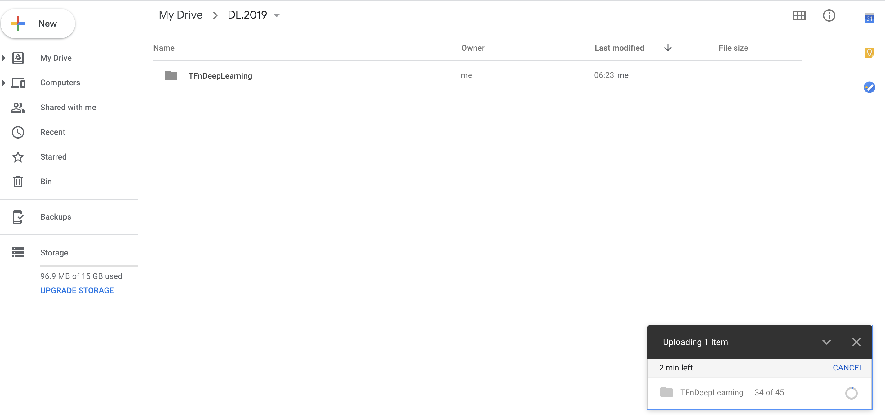
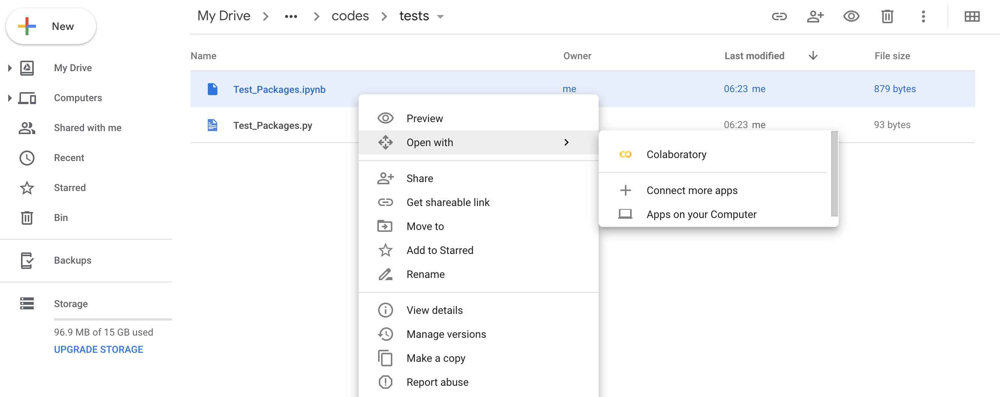
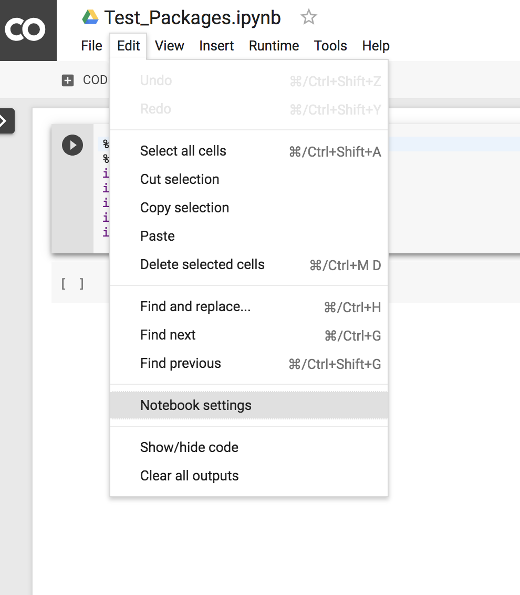
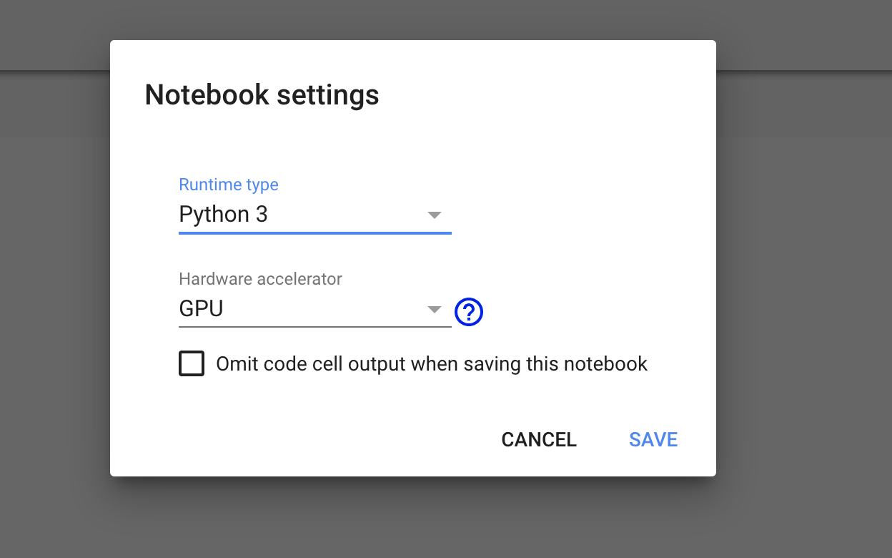
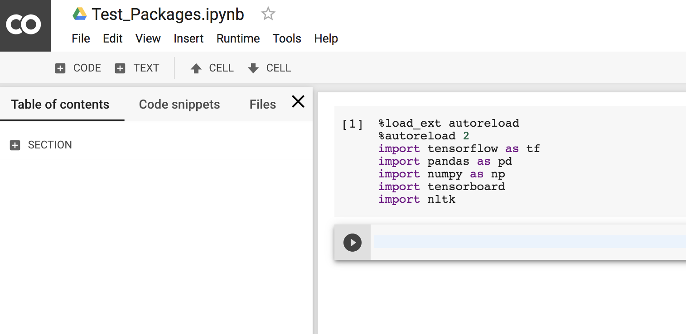
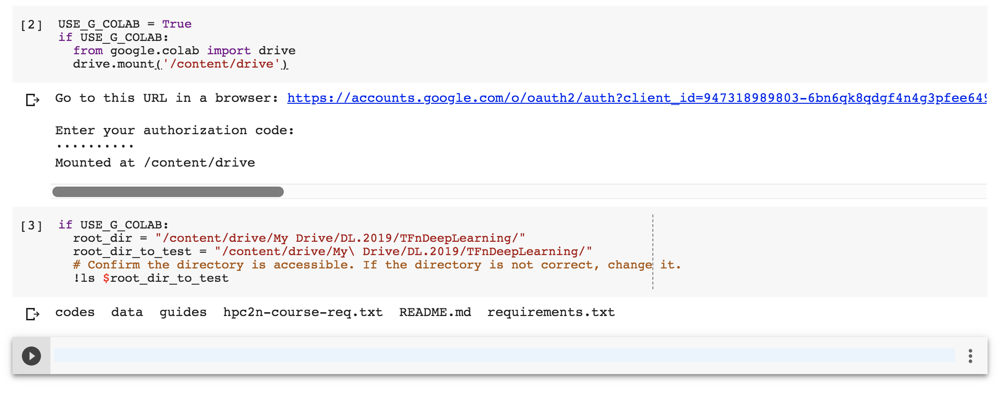

# How to use Google Colab

1. Go to drive.google.com, create a folder called: **DL.2019**
2. Go to [TFnDeepLearning](https://github.com/ddmatumu/TFnDeepLearning), then download and extract 
the source code as a zip file.
3. Go to “DL.2019”, then upload the folder **TFnDeepLearning** (remove the word **master** in the folder name):

4. Go to `TFnDeepLearning/codes/tests/` -> right click on the file `Test_Packages.ipynb` -> choose `Colaboratory` 
(please install the app `Colaboratory` if you don't see the app name shows up):

5. Change to use GPU: Edit -> Notebook Settings -> Choose python version 3 and GPU ->
Save.  

6. Connect **Google Colab** to your **Google Drive**:

- Copy and paste these codes:

~~~~
USE_G_COLAB = True
if USE_G_COLAB:
  from google.colab import drive
  drive.mount('/content/drive')
~~~~

- Remember to click to the link and paste authentication codes. 
Then copy these following codes to test if **Google Colab** is connected to your **Google Drive** properly:

~~~~
if USE_G_COLAB:
  root_dir = "/content/drive/My Drive/DL.2019/TFnDeepLearning/"
  root_dir_to_test = "/content/drive/My\ Drive/DL.2019/TFnDeepLearning/"
  # Confirm the directory is accessible. If the directory is not correct, change it.
  !ls $root_dir_to_test
~~~~

- This is how the whole process looks like:

- Congratulations, that would be all. You are done with the installation. 
If you have any issues, please create [issues](https://github.com/ddmatumu/TFnDeepLearning/issues), we are happy to help.