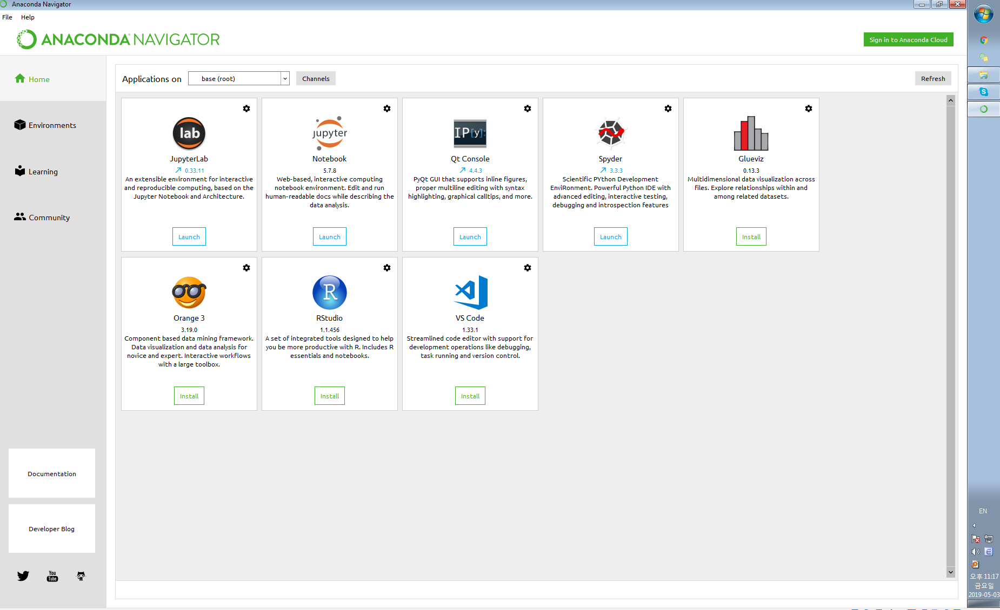
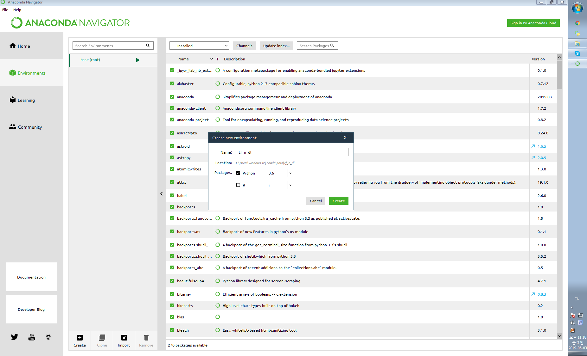
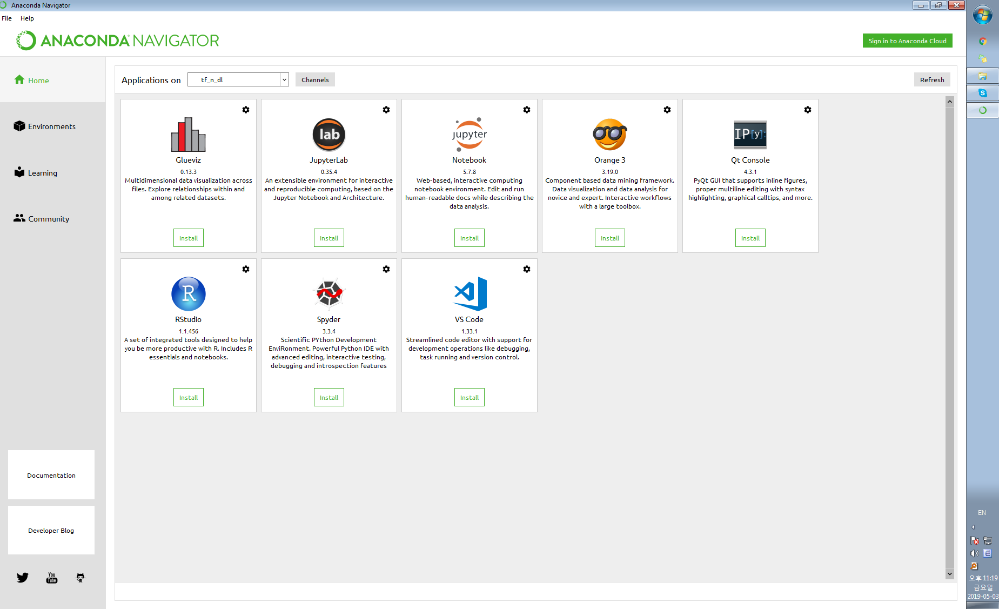
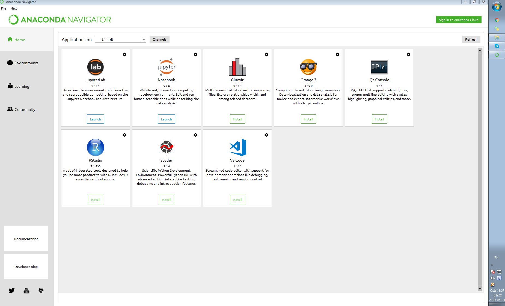
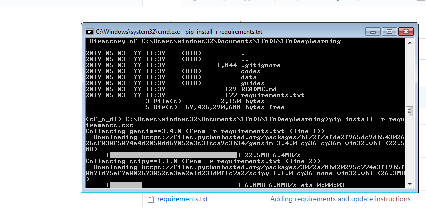
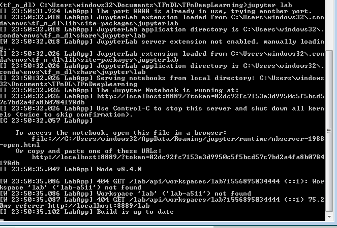
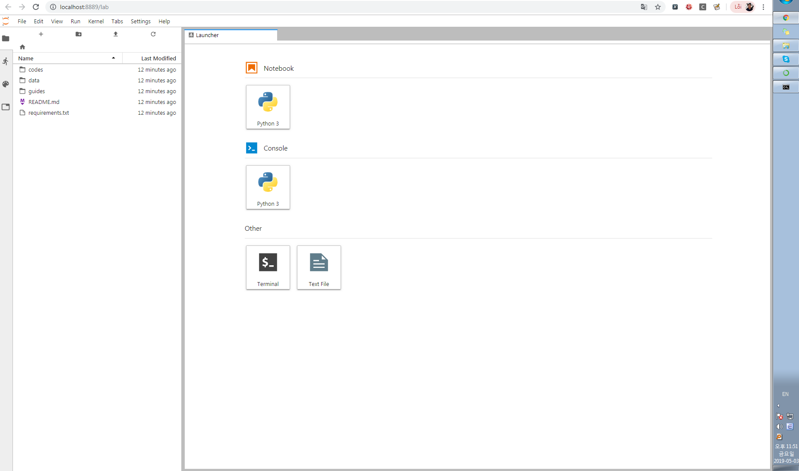
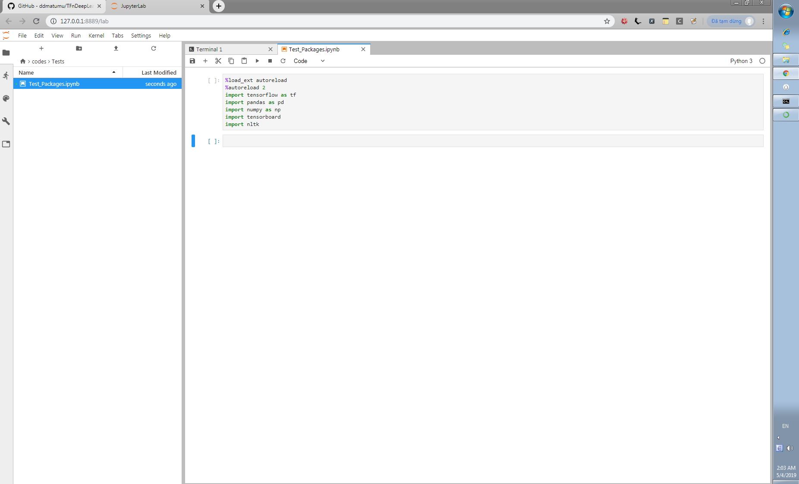

# How to install Anaconda and Tensorflow on Windows 64bits:
(For Windows 32bits, you will run into many troubles with TF, therefore, you are recommended to use Google Colab or 
the account provided by HPC2N directly).
1. Download the Anaconda installer.
2. Optional: Verify data integrity with MD5 or SHA-256. More info on hashes.
3. Double click the installer to launch and continue the installation normally. See more 
(here)[https://docs.anaconda.com/anaconda/install/windows/] if you want to follow the process step by step.
4. After your install is complete, verify it by opening Anaconda Navigator:

5. Go to *Environments* and create a new environment called **tf_n_dl** (remember to choose python3.6):

6. Go to **HOME** -> select **Applications on tf_n_dl** -> Click *Install* Jupyter Lab:

7. Click *Launch* the Jupyter Lab:

8. Go to **Environments** -> click on triangle button of **tf_n_dl** -> open Console and run this command:
(If you don't have Git command, go to (this link)[https://gitforwindows.org/] to download and install it).
> git clone https://github.com/ddmatumu/TFnDeepLearning.git 
> cd TFnDeepLearning; pip install -r requirements.txt

9. When you're done with the *Installation*, run the following command to open *Jupyter Lab*:
> jupyter lab --ip=127.0.0.1

10. In the Launcher, under *Notebook* -> click to *python3*:

11. Open the notebook file at `./codes/tests/Test_Packages.ipynb`:

## Congratulations, you are done with the installation.