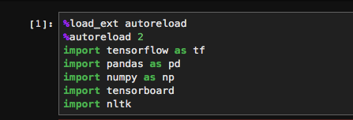

# Table of contents
1. [Jupyter Lab (recommended)](#jupyter_lab)
    1. [Unix/Linux Users](#installation_linux_unix)
    2. [Windows Users](#installation_windows)
2. [HPC2N Console (optional)](#installation_hpc2n)
3. [Google Colab (optional)](#howto_google_colab)
4. [Test required packages](#test_packages)

# I. Jupyter Lab :
## 1. Install Jupyter Lab:
### 1.1. For Unix/Linux users: choose *ONE* of following options .
#### 01. Anaconda (recommended, read more [here](https://www.anaconda.com/) if you haven't used Anaconda before.)
Create a new python environment called *tf_n_dl* (or activate your current in-use environment)
> conda create -n tf_n_dl python=3.6 
> conda activate tf_n_dl 
> conda install -c conda-forge jupyterlab
#### 02. pip (directly to your default python environment)
> pip install jupyterlab
#### 03. pipenv (read more [here](https://github.com/pypa/pipenv))
> pipenv install jupyterlab 
> pipenv shell
### 1.2. For Windows users: see this [Install-Windows](Install_Windows.md) . 

## 2. Starting JupyterLab
Active your python environment and simply type this following command using the console:
> jupyter lab --ip=127.0.0.1

JupyterLab will open automatically in the browser with an interface resembling the one below.

** Read more about Jupyter Lab and its advantages at this 
[link](https://towardsdatascience.com/jupyter-lab-evolution-of-the-jupyter-notebook-5297cacde6b?fbclid=IwAR3O0QkkhCwK1BBJM6akHOhcdM_ZtvgcrHzCYrJj3dJ3IvVS3gk6TSziuTk).

## 3. Install required packages:
1. In the menu of *Jupyter Lab*, click File -> New -> Terminal. Make sure your current active python environment is *tf_n_dl* (the ENV name will appear at the beginning of the command prompt).
2. Clone the github repo of this course:
> git clone https://github.com/ddmatumu/TFnDeepLearning.git
3. Go to the repo and install requirements:
> cd TFnDeepLearning; pip install -r requirements.txt
4. Install ETNLP:
> git clone https://github.com/vietnlp/etnlp.git 
> cd src/codes/
> python setup.py install

# 2. Install for HPC2N (console) :
See [Install-HPC2N](Install-HPC2N.md).

# 3. Google Colab :
See [Howto-Google-Colab](Howto_GoogleColab.md).

# II. Test required packages :
 
## 1. With **Jupyter Lab** or **Google Colab**:
1. On the *Jupyter Lab* (or *Google Colab*), open `codes/tests/Test_Packages.jpnb`
2. Run the import packages section to see if all packages are installed properly:

3. If there is no error, congratulation, you're done with the installation part.

## 2. With console on HPC2N:
> cd TFnDeepLearning; python3 codes/tests/Test_Packages.py
